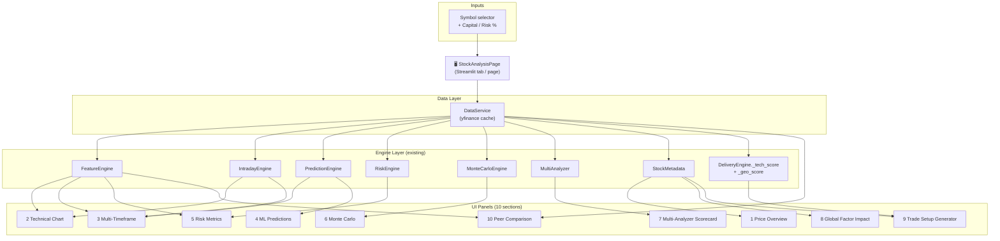
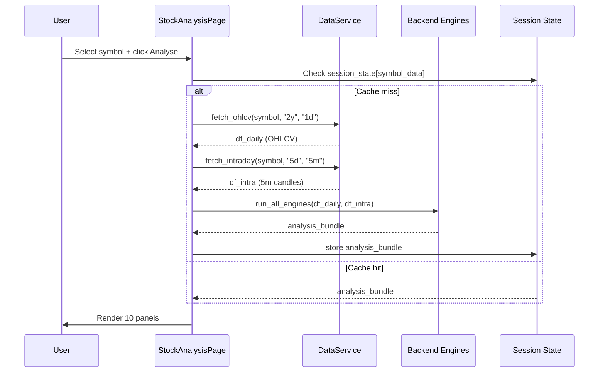
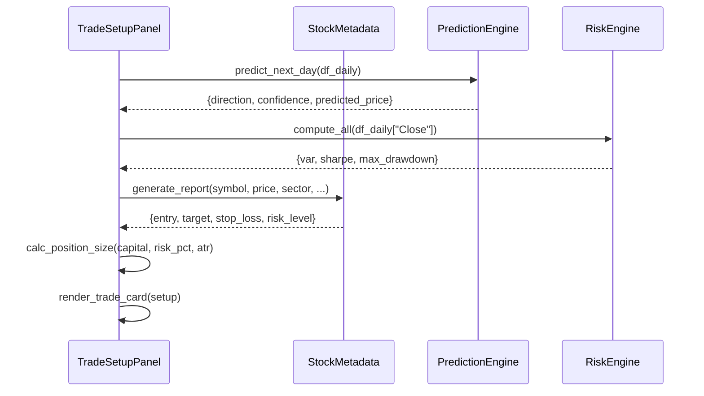

# Design Document: Comprehensive Stock Analysis Page

## Overview

A single-stock deep-dive page for QuantSignal India that aggregates every
available backend engine into one unified, scrollable Streamlit view. A user
selects any NSE symbol and immediately sees price overview, full technical
chart, multi-timeframe signals, ML predictions, risk metrics, Monte Carlo
simulation, multi-analyzer scorecard, global factor impact, an auto-generated
trade setup, and a peer comparison — all without leaving the page.

The page is implemented as a new tab (`"🔍 Deep Dive"`) appended to the
existing tab list in `live_trader.py`, and optionally as a standalone
`pages/stock_analysis.py` for Streamlit multi-page navigation. It reuses
every existing backend engine without modification.

---

## Architecture



---

## Sequence Diagrams

### Main Analysis Flow



### Trade Setup Generation



---

## Components and Interfaces

### Component 1: StockAnalysisPage (orchestrator)

**Purpose**: Top-level Streamlit component. Owns the symbol selector, triggers
data loading, and delegates rendering to each panel function.

**Interface**:
```python
def render_stock_analysis_tab(
    capital: float,
    risk_pct: float,
    symbol_list: list[str],
) -> None:
    """
    Renders the full deep-dive page inside a Streamlit tab context.
    Called from live_trader.py tab list.
    """
```

**Responsibilities**:
- Symbol selector (searchable selectbox over ALL_SYMBOLS_CLEAN)
- Capital / risk % inputs (pre-filled from sidebar values)
- "Analyse" button → triggers `load_analysis_bundle()`
- Caches result in `st.session_state["sap_{symbol}"]`
- Calls each panel renderer in order

---

### Component 2: DataLoader

**Purpose**: Fetches and bundles all raw data needed by the page in one pass.

**Interface**:
```python
def load_analysis_bundle(
    symbol: str,
    capital: float,
    risk_pct: float,
) -> AnalysisBundle:
    """
    Fetches daily + intraday OHLCV, runs all engines, returns typed bundle.
    Raises ValueError if symbol has insufficient data.
    """
```

**Responsibilities**:
- `DataService.fetch_ohlcv(symbol+".NS", "2y")` → df_daily
- `IntradayEngine.fetch_intraday(symbol+".NS", "5d", "5m")` → df_intra
- `IntradayEngine.add_indicators(df_intra)` → df_intra_ind
- `FeatureEngine.compute_all_features(df_daily)` → df_features
- Parallel execution of engine calls via `ThreadPoolExecutor`
- Returns `AnalysisBundle` dataclass

---

### Component 3: PriceOverviewPanel

**Purpose**: Renders the top summary strip — current price, 52w range, cap
classification, sector badge, penny/small/mid/large badge.

**Interface**:
```python
def render_price_overview(bundle: AnalysisBundle) -> None: ...
```

**Responsibilities**:
- Display current price, 1d change %, 52w high/low
- `StockMetadata.classify_price(price)` → cap badge
- `StockMetadata.get_risk_level(price, vol, rsi)` → risk badge
- Sector badge from `SYMBOL_TO_SECTOR`

---

### Component 4: TechnicalChartPanel

**Purpose**: Full candlestick chart with all overlays on daily data.

**Interface**:
```python
def render_technical_chart(
    df_daily: pd.DataFrame,
    df_features: pd.DataFrame,
    df_intra: pd.DataFrame,
    timeframe: str,  # "Daily" | "Intraday 5m"
) -> None: ...
```

**Responsibilities**:
- Plotly `make_subplots(rows=4)`: Candles+overlays / RSI / MACD / Volume
- Overlays: EMA9, EMA21, EMA50, EMA200, VWAP (intraday), Bollinger Bands, Supertrend
- Timeframe toggle: Daily (df_daily) vs Intraday 5m (df_intra)
- Entry/Target/SL horizontal lines if trade setup exists

---

### Component 5: MultiTimeframePanel

**Purpose**: Signal summary table across 5m, 1d, 1w timeframes.

**Interface**:
```python
def render_multi_timeframe(
    symbol: str,
    df_intra: pd.DataFrame,
    df_daily: pd.DataFrame,
    df_weekly: pd.DataFrame,
) -> None: ...
```

**Responsibilities**:
- `IntradayEngine.score_stock(df_intra)` → 5m signal
- `FeatureEngine` + `MultiAnalyzer` on df_daily → 1d signal
- `FeatureEngine` + `MultiAnalyzer` on df_weekly → 1w signal
- Render 3-column signal cards: timeframe / signal / key reasons

---

### Component 6: MLPredictionPanel

**Purpose**: Shows next-day, 10-day, 30-day ML predictions.

**Interface**:
```python
def render_ml_predictions(
    df_daily: pd.DataFrame,
    current_price: float,
) -> None: ...
```

**Responsibilities**:
- `PredictionEngine.predict_next_day(df_daily)` → 1-day pred
- `PredictionEngine.predict_multi_horizon(df_daily)` → 10/30-day preds
- Render prediction cards: direction badge, confidence bar, price range
- Market conditions list from `predict_next_day`

---

### Component 7: RiskMetricsPanel

**Purpose**: Tabular risk metrics with colour-coded thresholds.

**Interface**:
```python
def render_risk_metrics(
    df_daily: pd.DataFrame,
    risk_free_rate: float = 0.065,
) -> None: ...
```

**Responsibilities**:
- `RiskEngine.compute_all(df_daily["Close"])` → full metrics dict
- Display: VaR 95%, CVaR, Sharpe, Sortino, Max Drawdown, Calmar, Annual Vol
- Colour thresholds: Sharpe > 1 = green, 0–1 = yellow, < 0 = red
- `RiskEngine.stress_test(returns)` → stress scenario table

---

### Component 8: MonteCarloPanel

**Purpose**: 30-day GBM simulation with fan chart and probability stats.

**Interface**:
```python
def render_monte_carlo(
    df_daily: pd.DataFrame,
    n_simulations: int = 5000,
    n_days: int = 30,
) -> None: ...
```

**Responsibilities**:
- `MonteCarloEngine.simulate(df_daily["Close"], n_simulations, n_days)`
- Fan chart: p5/p25/median/p75/p95 bands + 50 sample paths
- Metrics: prob_profit, expected_price, VaR 95%, CVaR

---

### Component 9: MultiAnalyzerScorecardPanel

**Purpose**: Radar chart + per-analyzer breakdown cards.

**Interface**:
```python
def render_multi_analyzer_scorecard(
    df_daily: pd.DataFrame,
    sector: str,
    capital: float,
    risk_pct: float,
) -> None: ...
```

**Responsibilities**:
- `MultiAnalyzer().analyze(df_daily, sector, capital, risk_pct)`
- Radar chart: Technical / Momentum / Volume / Global Macro / Geopolitical
- Per-analyzer score cards with signal badge and detail expander
- Combined signal badge (STRONG BUY / BUY / NEUTRAL / SELL)

---

### Component 10: GlobalFactorPanel

**Purpose**: Sector-specific geopolitical and macro themes.

**Interface**:
```python
def render_global_factors(sector: str) -> None: ...
```

**Responsibilities**:
- `StockMetadata.get_global_factors(sector)` → positive/negative/theme
- Render positive factors as green chips, negative as red chips
- Theme badge (STRONG TAILWIND / MODERATE / NEUTRAL)

---

### Component 11: TradeSetupPanel

**Purpose**: Auto-generates entry, target, SL, position size.

**Interface**:
```python
def render_trade_setup(
    bundle: AnalysisBundle,
    capital: float,
    risk_pct: float,
) -> None: ...
```

**Responsibilities**:
- ATR-based entry/target/SL (same formula as `SmartIntradayEngine._score_symbol`)
- Position size = `floor(capital * risk_pct / (entry - stop_loss))`
- Invested amount, max profit, max loss, R:R ratio
- Capital slider override (re-calculates without re-fetching data)
- Copy-to-clipboard button for trade details

---

### Component 12: PeerComparisonPanel

**Purpose**: Side-by-side comparison with 3–5 sector peers.

**Interface**:
```python
def render_peer_comparison(
    symbol: str,
    sector: str,
    df_daily: pd.DataFrame,
    peer_symbols: list[str],
) -> None: ...
```

**Responsibilities**:
- Auto-select peers from `SECTOR_GROUPS[sector]` (top 4 by market cap proxy)
- Fetch peer daily data via `DataService.fetch_multiple(peers, "6mo")`
- Metrics table: current price, 1m/3m/6m return, RSI, volatility, Sharpe
- Normalised price chart (rebased to 100) for visual comparison

---

## Data Models

### AnalysisBundle

```python
from dataclasses import dataclass, field
import pandas as pd

@dataclass
class AnalysisBundle:
    symbol: str                        # clean symbol, e.g. "RELIANCE"
    yf_symbol: str                     # "RELIANCE.NS"
    sector: str                        # from SYMBOL_TO_SECTOR
    capital: float
    risk_pct: float

    # Raw data
    df_daily: pd.DataFrame             # 2y daily OHLCV
    df_intra: pd.DataFrame             # 5d 5m OHLCV with indicators
    df_weekly: pd.DataFrame            # 2y weekly OHLCV
    df_features: pd.DataFrame          # daily with all FeatureEngine columns

    # Derived scalars
    current_price: float
    price_52w_high: float
    price_52w_low: float
    price_change_1d: float             # % change
    price_change_1d_abs: float         # absolute change

    # Engine outputs (populated by load_analysis_bundle)
    intra_score: dict                  # IntradayEngine.score_stock result
    pred_next_day: dict                # PredictionEngine.predict_next_day
    pred_multi: dict                   # PredictionEngine.predict_multi_horizon
    risk_metrics: dict                 # RiskEngine.compute_all
    mc_result: dict                    # MonteCarloEngine.simulate
    ma_result: dict                    # MultiAnalyzer.analyze
    metadata_report: dict              # StockMetadata.generate_report

    # Computed trade setup
    trade_setup: "TradeSetup"

    # Peer data (lazy-loaded)
    peer_data: dict = field(default_factory=dict)  # symbol → df
```

### TradeSetup

```python
@dataclass
class TradeSetup:
    entry: float
    target_1: float                    # entry + 2 * ATR
    target_2: float                    # entry + 3 * ATR
    stop_loss: float                   # entry - 1.5 * ATR (min entry * 0.93)
    atr: float
    risk_per_share: float              # entry - stop_loss
    reward_per_share: float            # target_1 - entry
    risk_reward: float                 # reward / risk
    qty: int                           # floor(capital * risk_pct / risk_per_share)
    invested: float                    # qty * entry
    max_profit: float                  # qty * reward_per_share
    max_loss: float                    # qty * risk_per_share
    signal: str                        # "BUY" | "WATCH" | "AVOID"
    confidence: float                  # from ma_result combined_score
```

### TimeframeSignal

```python
@dataclass
class TimeframeSignal:
    timeframe: str                     # "5m Intraday" | "1d Swing" | "1w Positional"
    signal: str                        # "BUY" | "SELL" | "NEUTRAL"
    score: float                       # 0–1
    rsi: float
    macd_bullish: bool
    above_ema: bool                    # price > EMA21
    supertrend: str                    # "BUY" | "SELL" (intraday only)
    reasons: list[str]
```

### PeerMetrics

```python
@dataclass
class PeerMetrics:
    symbol: str
    current_price: float
    return_1m: float                   # %
    return_3m: float                   # %
    return_6m: float                   # %
    rsi: float
    volatility: float                  # annualised
    sharpe: float
    is_target: bool                    # True for the stock being analysed
```

---

## Algorithmic Pseudocode

### Main Orchestration: load_analysis_bundle()

```pascal
ALGORITHM load_analysis_bundle(symbol, capital, risk_pct)
INPUT:  symbol: str, capital: float, risk_pct: float
OUTPUT: bundle: AnalysisBundle

PRECONDITIONS:
  - symbol is a valid NSE ticker (without .NS suffix)
  - capital > 0
  - 0 < risk_pct <= 0.10

POSTCONDITIONS:
  - bundle.df_daily has >= 60 rows
  - bundle.trade_setup.risk_reward > 0
  - All engine output dicts are non-empty

BEGIN
  yf_sym ← symbol + ".NS"

  // Parallel data fetch
  PARALLEL DO
    df_daily  ← DataService.fetch_ohlcv(yf_sym, period="2y", interval="1d")
    df_intra  ← IntradayEngine.fetch_intraday(yf_sym, period="5d", interval="5m")
    df_weekly ← DataService.fetch_ohlcv(yf_sym, period="5y", interval="1wk")
  END PARALLEL

  IF df_daily.empty OR len(df_daily) < 60 THEN
    RAISE ValueError("Insufficient daily data for " + symbol)
  END IF

  df_intra  ← IntradayEngine.add_indicators(df_intra)
  df_features ← FeatureEngine.compute_all_features(df_daily)

  price ← df_daily["Close"].iloc[-1]
  sector ← SYMBOL_TO_SECTOR.get(symbol, "Other")

  // Parallel engine execution
  PARALLEL DO
    intra_score   ← IntradayEngine.score_stock(df_intra)
    pred_next_day ← PredictionEngine.predict_next_day(df_daily)
    pred_multi    ← PredictionEngine.predict_multi_horizon(df_daily)
    risk_metrics  ← RiskEngine.compute_all(df_daily["Close"])
    mc_result     ← MonteCarloEngine.simulate(df_daily["Close"], 5000, 30)
    ma_result     ← MultiAnalyzer().analyze(df_daily, sector, capital, risk_pct)
  END PARALLEL

  metadata_report ← StockMetadata.generate_report(
    symbol, price, sector,
    confidence=ma_result["combined_score"],
    direction=pred_next_day.get("direction","NEUTRAL"),
    predicted_return=pred_next_day.get("predicted_return",0),
    volatility=risk_metrics.get("volatility_annual",0.25),
    rsi=intra_score["rsi"],
    entry=price,
    target=price * 1.05,
    stop_loss=price * 0.97,
    mode="swing"
  )

  trade_setup ← compute_trade_setup(price, df_daily, capital, risk_pct, ma_result)

  RETURN AnalysisBundle(
    symbol, yf_sym, sector, capital, risk_pct,
    df_daily, df_intra, df_weekly, df_features,
    price, ...,
    intra_score, pred_next_day, pred_multi,
    risk_metrics, mc_result, ma_result, metadata_report,
    trade_setup
  )
END
```

**Loop Invariants**: N/A (no loops; parallel futures are independent)

---

### Trade Setup Computation: compute_trade_setup()

```pascal
ALGORITHM compute_trade_setup(price, df_daily, capital, risk_pct, ma_result)
INPUT:  price: float, df_daily: DataFrame, capital: float,
        risk_pct: float, ma_result: dict
OUTPUT: setup: TradeSetup

PRECONDITIONS:
  - price > 0
  - len(df_daily) >= 14  (ATR requires 14 bars)
  - 0 < risk_pct <= 0.10

POSTCONDITIONS:
  - setup.stop_loss < setup.entry
  - setup.target_1 > setup.entry
  - setup.risk_reward > 0
  - setup.qty >= 0

BEGIN
  // ATR calculation (14-period)
  high ← df_daily["High"]
  low  ← df_daily["Low"]
  prev_close ← df_daily["Close"].shift(1)
  tr  ← max(high-low, |high-prev_close|, |low-prev_close|) per row
  atr ← tr.rolling(14).mean().iloc[-1]
  atr ← max(atr, price * 0.005)   // floor at 0.5% of price

  entry     ← round(price, 2)
  stop_loss ← round(max(entry - 1.5 * atr, entry * 0.93), 2)
  target_1  ← round(entry + 2.0 * atr, 2)
  target_2  ← round(entry + 3.0 * atr, 2)

  risk_per_share   ← entry - stop_loss
  reward_per_share ← target_1 - entry

  IF risk_per_share > 0 THEN
    risk_reward ← round(reward_per_share / risk_per_share, 2)
    qty         ← floor(capital * risk_pct / risk_per_share)
  ELSE
    risk_reward ← 0
    qty         ← 0
  END IF

  qty       ← max(qty, 0)
  invested  ← round(qty * entry, 2)
  max_profit ← round(qty * reward_per_share, 2)
  max_loss   ← round(qty * risk_per_share, 2)

  confidence ← ma_result.get("combined_score", 0.5)
  signal ← "BUY" IF confidence >= 0.55 ELSE
            "WATCH" IF confidence >= 0.45 ELSE "AVOID"

  RETURN TradeSetup(entry, target_1, target_2, stop_loss, atr,
                    risk_per_share, reward_per_share, risk_reward,
                    qty, invested, max_profit, max_loss, signal, confidence)
END
```

---

### Multi-Timeframe Signal: build_timeframe_signals()

```pascal
ALGORITHM build_timeframe_signals(symbol, df_intra, df_daily, df_weekly)
INPUT:  symbol: str, df_intra: DataFrame (5m, with indicators),
        df_daily: DataFrame (1d), df_weekly: DataFrame (1wk)
OUTPUT: signals: list[TimeframeSignal]

PRECONDITIONS:
  - df_intra has columns: RSI, EMA9, EMA21, MACD_Hist, ST_Direction
  - df_daily and df_weekly have OHLCV columns

POSTCONDITIONS:
  - len(signals) == 3
  - Each signal.score in [0, 1]

BEGIN
  signals ← []

  // 5m Intraday signal
  IF NOT df_intra.empty AND len(df_intra) >= 30 THEN
    sc_5m ← IntradayEngine.score_stock(df_intra)
    signals.append(TimeframeSignal(
      timeframe="5m Intraday",
      signal="BUY" IF sc_5m["score"] >= 0.55 ELSE
             "SELL" IF sc_5m["score"] < 0.35 ELSE "NEUTRAL",
      score=sc_5m["score"],
      rsi=sc_5m["rsi"],
      macd_bullish=df_intra["MACD_Hist"].iloc[-1] > 0,
      above_ema=df_intra["Close"].iloc[-1] > df_intra["EMA21"].iloc[-1],
      supertrend=sc_5m["supertrend"],
      reasons=sc_5m["reasons"]
    ))
  END IF

  // 1d Swing signal
  FOR tf_label, df_tf IN [("1d Swing", df_daily), ("1w Positional", df_weekly)] DO
    IF NOT df_tf.empty AND len(df_tf) >= 30 THEN
      feat ← FeatureEngine.compute_all_features(df_tf)
      last ← feat.iloc[-1]
      rsi  ← last.get("RSI", 50)
      macd_hist ← last.get("MACD_Hist", 0)
      price ← df_tf["Close"].iloc[-1]
      ema21 ← last.get("MA20", price)   // use MA20 as proxy for swing EMA

      // Simple score: RSI zone + MACD + MA position
      s ← 0.5
      s ← s + 0.15 IF rsi < 45 ELSE s - 0.10 IF rsi > 70 ELSE s + 0.05
      s ← s + 0.15 IF macd_hist > 0 ELSE s - 0.05
      s ← s + 0.10 IF price > ema21 ELSE s - 0.05
      s ← clip(s, 0, 1)

      signals.append(TimeframeSignal(
        timeframe=tf_label,
        signal="BUY" IF s >= 0.55 ELSE "SELL" IF s < 0.35 ELSE "NEUTRAL",
        score=s, rsi=rsi,
        macd_bullish=macd_hist > 0,
        above_ema=price > ema21,
        supertrend="N/A",
        reasons=[]
      ))
    END IF
  END FOR

  RETURN signals
END
```

---

### Peer Comparison: load_peer_data()

```pascal
ALGORITHM load_peer_data(symbol, sector, df_daily)
INPUT:  symbol: str, sector: str, df_daily: DataFrame
OUTPUT: peers: list[PeerMetrics]

PRECONDITIONS:
  - sector is a key in SECTOR_GROUPS
  - df_daily has >= 126 rows (6 months)

POSTCONDITIONS:
  - len(peers) between 1 and 5
  - peers[0].is_target == True (the analysed stock is always first)

BEGIN
  sector_syms ← SECTOR_GROUPS.get(sector, [])
  // Remove the target symbol, take up to 4 peers
  candidates ← [s.replace(".NS","") FOR s IN sector_syms IF s.replace(".NS","") != symbol]
  peer_syms  ← candidates[:4]

  all_syms ← [symbol] + peer_syms
  peer_dfs ← DataService.fetch_multiple([s+".NS" FOR s IN all_syms], period="6mo")

  peers ← []
  FOR sym IN all_syms DO
    df ← peer_dfs.get(sym+".NS", empty)
    IF df.empty OR len(df) < 20 THEN CONTINUE END IF

    feat ← FeatureEngine.compute_all_features(df)
    last ← feat.iloc[-1]
    price ← df["Close"].iloc[-1]
    returns ← df["Close"].pct_change().dropna()

    peers.append(PeerMetrics(
      symbol=sym,
      current_price=round(price, 2),
      return_1m=round((df["Close"].iloc[-1]/df["Close"].iloc[-21]-1)*100, 2) IF len(df)>=21 ELSE 0,
      return_3m=round((df["Close"].iloc[-1]/df["Close"].iloc[-63]-1)*100, 2) IF len(df)>=63 ELSE 0,
      return_6m=round((df["Close"].iloc[-1]/df["Close"].iloc[0]-1)*100, 2),
      rsi=round(last.get("RSI",50), 1),
      volatility=round(returns.std()*sqrt(252)*100, 1),
      sharpe=round(RiskEngine.sharpe_ratio(returns), 2),
      is_target=(sym == symbol)
    ))
  END FOR

  RETURN peers
END
```

---

## Key Functions with Formal Specifications

### render_stock_analysis_tab()

```python
def render_stock_analysis_tab(capital: float, risk_pct: float, symbol_list: list[str]) -> None
```

**Preconditions:**
- `capital > 0`
- `0 < risk_pct <= 0.10`
- `symbol_list` is non-empty

**Postconditions:**
- Streamlit UI is rendered with all 10 panels visible
- `st.session_state["sap_{symbol}"]` is populated after first run
- No exceptions propagate to the user (all engine errors are caught and shown as `st.warning`)

**Loop Invariants:** N/A

---

### load_analysis_bundle()

```python
def load_analysis_bundle(symbol: str, capital: float, risk_pct: float) -> AnalysisBundle
```

**Preconditions:**
- `symbol` does not contain `.NS` suffix
- `DataService` can reach yfinance (network available)

**Postconditions:**
- `bundle.df_daily` has at least 60 rows
- `bundle.trade_setup.entry == round(bundle.current_price, 2)`
- `bundle.trade_setup.stop_loss < bundle.trade_setup.entry`
- `bundle.trade_setup.target_1 > bundle.trade_setup.entry`
- All engine dicts contain no `"error"` key (or error is handled gracefully)

**Loop Invariants:** N/A (parallel futures, no sequential loop)

---

### compute_trade_setup()

```python
def compute_trade_setup(
    price: float,
    df_daily: pd.DataFrame,
    capital: float,
    risk_pct: float,
    ma_result: dict,
) -> TradeSetup
```

**Preconditions:**
- `price > 0`
- `len(df_daily) >= 14`
- `capital > 0`, `0 < risk_pct <= 0.10`

**Postconditions:**
- `result.stop_loss < result.entry`
- `result.target_1 > result.entry`
- `result.risk_reward > 0` when `risk_per_share > 0`
- `result.qty >= 0`
- `result.invested == result.qty * result.entry` (within float precision)

**Loop Invariants:** N/A

---

### render_technical_chart()

```python
def render_technical_chart(
    df_daily: pd.DataFrame,
    df_features: pd.DataFrame,
    df_intra: pd.DataFrame,
    timeframe: str,
) -> None
```

**Preconditions:**
- `timeframe in ("Daily", "Intraday 5m")`
- `df_daily` has columns: Open, High, Low, Close, Volume
- `df_features` has columns: EMA9, EMA21, EMA50, EMA200, BB_Upper, BB_Lower, RSI, MACD_Hist

**Postconditions:**
- A 4-row Plotly subplot is rendered via `st.plotly_chart`
- Chart height is 600px
- `xaxis_rangeslider_visible = False`

**Loop Invariants:** N/A

---

### build_timeframe_signals()

```python
def build_timeframe_signals(
    symbol: str,
    df_intra: pd.DataFrame,
    df_daily: pd.DataFrame,
    df_weekly: pd.DataFrame,
) -> list[TimeframeSignal]
```

**Preconditions:**
- At least one of the three DataFrames is non-empty

**Postconditions:**
- `1 <= len(result) <= 3`
- For each signal: `signal.score in [0.0, 1.0]`
- For each signal: `signal.signal in ("BUY", "SELL", "NEUTRAL")`

**Loop Invariants:**
- For each iteration over `[("1d Swing", df_daily), ("1w Positional", df_weekly)]`:
  all previously appended signals remain valid

---

### load_peer_data()

```python
def load_peer_data(
    symbol: str,
    sector: str,
    df_daily: pd.DataFrame,
) -> list[PeerMetrics]
```

**Preconditions:**
- `symbol` is a clean NSE ticker (no `.NS`)
- `sector` is a key in `SECTOR_GROUPS` or empty string

**Postconditions:**
- `1 <= len(result) <= 5`
- `result[0].is_target == True` (target stock always first)
- All `PeerMetrics.return_*` values are finite floats

**Loop Invariants:**
- For each peer symbol processed: previously computed `PeerMetrics` objects remain unchanged

---

## UI Layout Wireframe Description

```
┌─────────────────────────────────────────────────────────────────────────────┐
│  SIDEBAR (existing)                                                          │
│  Capital / Risk % / Sector / Stock filters                                   │
└─────────────────────────────────────────────────────────────────────────────┘

TAB: "🔍 Deep Dive"
┌─────────────────────────────────────────────────────────────────────────────┐
│  [Symbol Selectbox ▼]  [Capital ₹ input]  [Risk % slider]  [🔍 ANALYSE]    │
├─────────────────────────────────────────────────────────────────────────────┤
│  ── SECTION 1: PRICE OVERVIEW ──────────────────────────────────────────── │
│  [RELIANCE]  ₹2,847.50  ▲ +1.2%  │ 52W: ₹2,220 ─────────── ₹3,217        │
│  [🏢 LARGE CAP]  [🧪 Chemicals]  [🟢 LOW RISK]  [Sector: 💰 Finance]      │
├─────────────────────────────────────────────────────────────────────────────┤
│  ── SECTION 2: TECHNICAL CHART ─────────────────────────────────────────── │
│  [Daily ●] [Intraday 5m ○]                                                  │
│  ┌─────────────────────────────────────────────────────────────────────┐   │
│  │  Candlestick + EMA9/21/50/200 + VWAP + Bollinger Bands             │   │
│  │  ─────────────────────────────────────────────────────────────────  │   │
│  │  RSI (14)                                                           │   │
│  │  ─────────────────────────────────────────────────────────────────  │   │
│  │  MACD Histogram                                                     │   │
│  │  ─────────────────────────────────────────────────────────────────  │   │
│  │  Volume bars                                                        │   │
│  └─────────────────────────────────────────────────────────────────────┘   │
├─────────────────────────────────────────────────────────────────────────────┤
│  ── SECTION 3: MULTI-TIMEFRAME SIGNALS ─────────────────────────────────── │
│  ┌──────────────┐  ┌──────────────┐  ┌──────────────┐                      │
│  │ 5m Intraday  │  │  1d Swing    │  │ 1w Positional│                      │
│  │  [BUY 72%]   │  │ [NEUTRAL 51%]│  │  [BUY 65%]   │                      │
│  │  RSI: 42     │  │  RSI: 55     │  │  RSI: 48     │                      │
│  │  MACD: ✅    │  │  MACD: ❌    │  │  MACD: ✅    │                      │
│  └──────────────┘  └──────────────┘  └──────────────┘                      │
├─────────────────────────────────────────────────────────────────────────────┤
│  ── SECTION 4: ML PREDICTIONS ──────────────────────────────────────────── │
│  ┌──────────────┐  ┌──────────────┐  ┌──────────────┐                      │
│  │  Next Day    │  │   10 Days    │  │   30 Days    │                      │
│  │  ▲ UP 68%    │  │  ▲ UP 71%    │  │  ▲ UP 65%    │                      │
│  │ ₹2,881       │  │ ₹2,950       │  │ ₹3,050       │                      │
│  │ [₹2,820–2,940]│  │[₹2,800–3,100]│  │[₹2,700–3,400]│                      │
│  └──────────────┘  └──────────────┘  └──────────────┘                      │
│  Market conditions: RSI neutral (55) · MACD bullish · Volume 1.3x          │
├─────────────────────────────────────────────────────────────────────────────┤
│  ── SECTION 5: RISK METRICS ────────────────────────────────────────────── │
│  VaR 95%: -2.1%  CVaR: -3.4%  Sharpe: 1.42  Sortino: 1.87                 │
│  Max DD: -18.3%  Calmar: 0.94  Annual Vol: 24.1%  Total Return: +31.2%     │
│  [Stress Test Table]                                                         │
├─────────────────────────────────────────────────────────────────────────────┤
│  ── SECTION 6: MONTE CARLO (30-day) ────────────────────────────────────── │
│  ┌─────────────────────────────────────────────────────────────────────┐   │
│  │  Fan chart: p5/p25/median/p75/p95 + 50 sample paths                │   │
│  └─────────────────────────────────────────────────────────────────────┘   │
│  Prob Profit: 62%  Expected: ₹2,940  p5: ₹2,510  p95: ₹3,380              │
├─────────────────────────────────────────────────────────────────────────────┤
│  ── SECTION 7: MULTI-ANALYZER SCORECARD ────────────────────────────────── │
│  Combined: 0.68  [BUY]                                                       │
│  ┌──────────────────────────────────────────────────────────────────┐       │
│  │  Radar chart: Technical / Momentum / Volume / Macro / Geo        │       │
│  └──────────────────────────────────────────────────────────────────┘       │
│  [Technical 72%] [Momentum 65%] [Volume 58%] [Macro 71%] [Geo 68%]         │
├─────────────────────────────────────────────────────────────────────────────┤
│  ── SECTION 8: GLOBAL FACTOR IMPACT ────────────────────────────────────── │
│  Theme: MODERATE TAILWIND                                                    │
│  ✅ India-US Mission 500  ✅ AI/cloud demand  ✅ Rupee tailwind              │
│  ⚠️ US recession risk  ⚠️ H1B visa restrictions                             │
├─────────────────────────────────────────────────────────────────────────────┤
│  ── SECTION 9: TRADE SETUP GENERATOR ───────────────────────────────────── │
│  Capital: [₹50,000 ──────●──────────] Risk: [2% ●──]                       │
│  Entry: ₹2,847  Target 1: ₹2,918  Target 2: ₹2,989  SL: ₹2,776            │
│  Qty: 35  Invested: ₹99,645  Max Profit: ₹2,485  Max Loss: ₹2,485  R:R 1:1 │
│  [📋 Copy Trade Setup]                                                       │
├─────────────────────────────────────────────────────────────────────────────┤
│  ── SECTION 10: PEER COMPARISON ────────────────────────────────────────── │
│  ┌──────────────────────────────────────────────────────────────────┐       │
│  │  Normalised price chart (rebased to 100, last 6 months)          │       │
│  └──────────────────────────────────────────────────────────────────┘       │
│  Symbol │ Price  │ 1M%  │ 3M%  │ 6M%  │ RSI │ Vol%  │ Sharpe               │
│  ★RELIANCE│₹2,847│+3.1%│+8.4%│+18.2%│ 55  │ 24.1% │ 1.42                 │
│  TCS    │₹3,920 │+1.2%│+4.1%│+12.3%│ 52  │ 21.3% │ 1.18                 │
└─────────────────────────────────────────────────────────────────────────────┘
```

---

## Correctness Properties

*A property is a characteristic or behavior that should hold true across all valid executions of a system — essentially, a formal statement about what the system should do. Properties serve as the bridge between human-readable specifications and machine-verifiable correctness guarantees.*

### Property 1: Trade Setup Ordering Invariant

*For any* valid combination of `price > 0`, `df_daily` with at least 14 rows, `capital > 0`, and `0 < risk_pct <= 0.10`, calling `compute_trade_setup` should always produce a `TradeSetup` where `stop_loss < entry < target_1 < target_2`.

**Validates: Requirements 11.1, 11.7**

### Property 2: Trade Setup Arithmetic Invariant

*For any* valid `TradeSetup`, the `invested` field should equal `qty * entry` within floating-point precision, `qty` should be non-negative, and when `risk_per_share > 0` the `risk_reward` should be positive.

**Validates: Requirements 11.3, 11.8, 11.9, 11.10**

### Property 3: ATR Floor Prevents Zero Division

*For any* price series where ATR computes to zero or NaN, the `compute_trade_setup` function should apply a floor of `price * 0.005`, ensuring `atr >= price * 0.005` always holds and position sizing never divides by zero.

**Validates: Requirements 11.2, 13.4**

### Property 4: Timeframe Signal Validity

*For any* combination of intraday, daily, and weekly DataFrames where at least one is non-empty with at least 30 rows, `build_timeframe_signals` should return between 1 and 3 `TimeframeSignal` objects where every signal's `score` is in `[0.0, 1.0]` and every signal's `signal` field is one of "BUY", "SELL", or "NEUTRAL".

**Validates: Requirements 5.2, 5.3, 5.4**

### Property 5: Multi-Analyzer Score and Signal Validity

*For any* valid OHLCV DataFrame passed to `MultiAnalyzer.analyze`, the result should have `combined_score` in `[0.0, 1.0]` and `signal` equal to one of "STRONG BUY", "BUY", "NEUTRAL", "SELL", or "STRONG SELL".

**Validates: Requirements 9.4, 9.5**

### Property 6: Monte Carlo Probability Bounds

*For any* price series with at least 30 rows and `n_simulations >= 100`, `MonteCarloEngine.simulate` should return `prob_profit` in `[0.0, 1.0]` and the percentile ordering `p5 <= p25 <= median_price <= p75 <= p95` should hold.

**Validates: Requirements 8.3, 8.4**

### Property 7: Peer Comparison Target Invariant

*For any* symbol and sector, `load_peer_data` should return a list of between 1 and 5 `PeerMetrics` objects where the first element has `is_target == True` and all `return_1m`, `return_3m`, `return_6m` fields are finite floats.

**Validates: Requirements 12.5, 12.6, 12.7**

### Property 8: Risk Metrics Non-Negativity

*For any* price series with at least 30 rows, `RiskEngine.compute_all` should return a `volatility_annual` value that is greater than or equal to 0.

**Validates: Requirements 7.4**

### Property 9: ML Prediction Direction Validity

*For any* valid OHLCV DataFrame with at least 100 rows, `PredictionEngine.predict_next_day` should return a result where the `direction` field is one of "UP", "DOWN", or "NEUTRAL".

**Validates: Requirements 6.4**

### Property 10: Global Factor Structure Invariant

*For any* sector string passed to `StockMetadata.get_global_factors`, the result should always contain the keys "positive", "negative", and "theme", even when the sector is not found in `GLOBAL_FACTORS`.

**Validates: Requirements 10.3, 10.4**

---

## Error Handling

### Error Scenario 1: Insufficient Data

**Condition**: `DataService.fetch_ohlcv` returns fewer than 60 rows (new listing, delisted, or network error)

**Response**: `load_analysis_bundle` raises `ValueError`; the UI catches it and renders `st.error("Insufficient data for {symbol}. Try a different stock.")`

**Recovery**: User selects a different symbol; no state is written to session_state

---

### Error Scenario 2: Engine Failure (partial)

**Condition**: One engine (e.g. `PredictionEngine`) raises an exception due to numerical instability or insufficient data for ML training

**Response**: The parallel executor catches the exception; the affected panel renders `st.warning("ML predictions unavailable — insufficient history")` while all other panels render normally

**Recovery**: `AnalysisBundle` stores `None` for the failed engine output; each panel renderer checks for `None` before rendering

---

### Error Scenario 3: Network Timeout

**Condition**: yfinance request times out during `load_analysis_bundle`

**Response**: `DataService.fetch_ohlcv` returns an empty DataFrame; `load_analysis_bundle` raises `ValueError`

**Recovery**: UI shows `st.error` with retry button; session_state is not updated so the previous result (if any) remains visible

---

### Error Scenario 4: Peer Data Unavailable

**Condition**: All peer symbols return empty DataFrames (e.g. sector has only one stock)

**Response**: `load_peer_data` returns a list containing only the target stock's metrics

**Recovery**: Peer comparison panel renders with a single row and a note: "No peer data available for this sector"

---

### Error Scenario 5: Zero ATR (illiquid stock)

**Condition**: ATR calculation returns 0 or NaN for a very illiquid stock

**Response**: `compute_trade_setup` applies the floor `atr = max(atr, price * 0.005)` ensuring ATR is always at least 0.5% of price

**Recovery**: Trade setup is computed normally; a `st.info` note flags the stock as potentially illiquid

---

## Testing Strategy

### Unit Testing Approach

Test each pure function in isolation with known inputs:
- `compute_trade_setup`: verify SL < entry, target > entry, R:R > 0 for various ATR values
- `build_timeframe_signals`: verify signal classification thresholds (score ≥ 0.55 → BUY)
- `load_peer_data`: verify target stock is always first, peer count ≤ 5
- `StockMetadata.classify_price`: verify penny/small/mid/large boundaries

### Property-Based Testing Approach

**Property Test Library**: `hypothesis`

Key properties to test:
- For any valid `(price, atr, capital, risk_pct)`: `compute_trade_setup` always satisfies `SL < entry < target_1 < target_2`
- For any OHLCV DataFrame with ≥ 14 rows: ATR is always positive after the floor
- For any `score in [0, 1]`: signal classification returns one of `{"BUY", "WATCH", "AVOID"}`
- For any `n_simulations ≥ 100`: `MonteCarloEngine.simulate` returns `prob_profit in [0, 1]`

### Integration Testing Approach

- End-to-end test with a known liquid stock (e.g. RELIANCE): verify all 10 panels render without exceptions
- Cache test: second call with same symbol returns cached `AnalysisBundle` without re-fetching
- Parallel execution test: verify `ThreadPoolExecutor` in `load_analysis_bundle` completes within 30 seconds for any NIFTY 50 stock

---

## Performance Considerations

- **Parallel data fetch**: `df_daily`, `df_intra`, `df_weekly` fetched concurrently via `ThreadPoolExecutor(max_workers=3)`
- **Parallel engine execution**: 6 engine calls run concurrently via `ThreadPoolExecutor(max_workers=6)`
- **Session state caching**: `AnalysisBundle` stored in `st.session_state["sap_{symbol}"]`; cache invalidated after 15 minutes (matching `DataService.CACHE_TTL`)
- **Monte Carlo**: default `n_simulations=5000` (not 10,000) to keep render time < 2s; user can increase via slider
- **Peer comparison**: lazy-loaded only when the user scrolls to Section 10 (use `st.expander` initially collapsed)
- **Chart data**: candlestick chart uses last 252 trading days (1 year) for daily, last 120 bars for intraday

---

## Security Considerations

- No user-supplied data is executed as code; symbol input is validated against `ALL_SYMBOLS_CLEAN` whitelist
- No API keys or credentials are stored in the page; all data comes from public yfinance endpoints
- Capital and risk % inputs are bounded (`min_value`, `max_value`) to prevent absurd position sizing

---

## Dependencies

All dependencies are already present in `requirements.txt`:

| Dependency | Usage |
|---|---|
| `streamlit` | UI framework |
| `plotly` | Charts (candlestick, radar, fan chart) |
| `yfinance` | Market data via `DataService` |
| `pandas` | DataFrame operations |
| `numpy` | Numerical computations |
| `scikit-learn` | ML models in `PredictionEngine` |
| `scipy` | VaR parametric in `RiskEngine` |

New file to create:
- `pages/stock_analysis.py` — standalone Streamlit page (optional, for multi-page nav)
- `backend/engines/stock_analysis_engine.py` — `AnalysisBundle`, `TradeSetup`, `TimeframeSignal`, `PeerMetrics` dataclasses + `load_analysis_bundle()`, `compute_trade_setup()`, `build_timeframe_signals()`, `load_peer_data()`

Integration point in `live_trader.py`:
```python
# Add to tab list (line ~340 in live_trader.py):
tab1, tab2, tab3, tab4, tab5, tab6, tab7 = st.tabs([
    "📡 Live Signals",
    "🪙 Penny Stocks",
    "🔮 Next-Day Picks",
    "📈 Forecast",
    "🔎 Stock Explorer",
    "📋 Reports",
    "🔍 Deep Dive",   # ← NEW
])

# At the end of the file:
with tab7:
    from backend.engines.stock_analysis_engine import render_stock_analysis_tab
    render_stock_analysis_tab(capital=capital, risk_pct=0.02, symbol_list=ALL_SYMBOLS_CLEAN)
```
